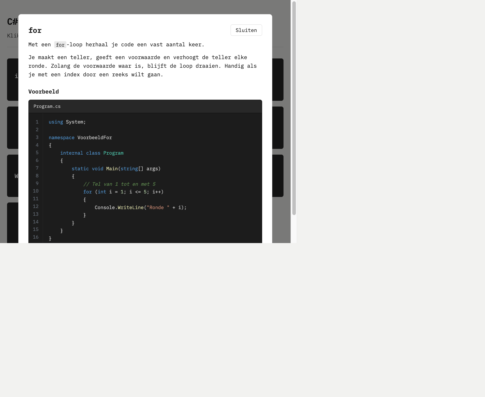

# C# onderwerpen

Een simpele website met kaarten om beginnende programmeurs de basis van C# uit
te leggen. Elke kaart is een onderwerp. Klik je op een kaart, dan zie je een
korte uitleg en een voorbeeld in echte editor-stijl met syntax highlighting.

Gemaakt voor lessen aan nieuwe programmeurs (16 tot 22 jaar).



## Wat het doet

- Overzicht van behandelde onderwerpen als kaarten (bijvoorbeeld `if`, `for`,
  `array`, `foreach`, `scope`).
- Per kaart: korte uitleg plus een C#-voorbeeld.
- Werkt als progressive web app (installeerbaar, werkt offline).
- Optionele QR-code om de site op je mobiel te openen (voeg `?showqr=1` toe aan
  de URL).
- Optioneel een korte URL groot in beeld (voeg `?showurl=1` toe aan de URL).
  Die korte URL (`basbrands.nl/cs`) is een eigen redirect, zonder reclame.

## Starten

```bash
npm install
npm start
```

De site draait dan op http://localhost:3000

## Bouwen voor publicatie

```bash
npm run build
```

De inhoud van de map `dist/` zet je op je webserver.

## Kaarten toevoegen

Elke kaart is een submap in [`kaarten/`](kaarten) met drie bestanden:
`meta.json`, `intro.md` en `Program.cs`. De site pikt nieuwe kaarten vanzelf op.
Zie [`kaarten/README.md`](kaarten/README.md) voor de details.

## Game

Klik op **Herlaad game** in de kop. Staat er een gamebestand op de server, dan
verschijnt de knop **Start game X** (X is het nummer uit het bestand).

Tijdens een game openen de kaarten niet. Jij stelt de vragen; de leerlingen
klikken op de kaart met het juiste antwoord. Na de laatste vraag verschijnt de
uitslag. Maximaal 10 vragen.

### Gamebestand maken

Maak een bestand `game.json` en zet het in de gepubliceerde map (naast
`index.html`). Zie [`game.example.json`](game.example.json) als voorbeeld:

```json
{
  "nummer": 1,
  "vragen": [
    { "vraag": "Welke lus herhaalt code een vast aantal keer?", "antwoord": "for" },
    { "vraag": "Waarin bewaar je meerdere waarden?", "antwoord": "array" }
  ]
}
```

- `antwoord` moet gelijk zijn aan de tekst op een kaart (bijvoorbeeld `for`,
  `switch`, `array`, `foreach`).
- Verhoog `nummer` bij een nieuwe game, zodat de knop het nieuwe nummer toont.
- Het bestand blijft bij een nieuwe `npm run build` bewaard.

